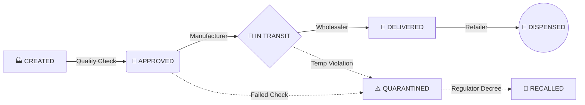

<div align="center">
   <!-- Pre-loads asset in some markdown parsers -->
  
  # 🧬 MEDICORE
  **Next-Generation Cryptographic Pharmaceutical Supply Chain**
  
  [](https://reactjs.org/)
  [](https://soliditylang.org/)
  [](https://tailwindcss.com/)
  [](https://www.framer.com/motion/)
  [](https://hardhat.org/)

  <p align="center">
    An enterprise-grade, Web3-powered architecture designed to completely eliminate counterfeit drugs, automate compliance, and track global medical shipments with zero-knowledge cryptography.
  </p>
</div>

---

## 🌌 The "Antigravity" UI Experience
MediCore isn't just a smart contract—it's a visual masterpiece. The frontend is built on a proprietary design language we call **Antigravity**.
* **Deep Dark Glassmorphism:** Immersive `slate-950` backdrops with heavily blurred frosted-glass layers.
* **Neon-Holographic Data:** Charts and stats glow with contextual colors (Emerald for active, Red for recalled).
* **Zero-Friction Routing:** Instantaneous sub-tab switching using CSS opacity crossfades without unmounting the React DOM.
* **Live Presentation Mode:** Built-in demo injectors allow for seamless, flawless live presentations without waiting for block confirmations.

## 🔗 Supply Chain Architecture

MediCore tracks the lifecycle of every drug using a strict, blockchain-enforced State Machine:



---

## 🎭 8-Tier Role-Based Access Control (RBAC)
The smart contract automatically detects your MetaMask wallet and routes you to your specific command center:

1. 💻 **SuperAdmin:** Manages global network nodes and executes emergency network halts.
2. 🏭 **Manufacturer (ABC Pharma):** Mints new cryptographic drug batches to the ledger.
3. 🔬 **Quality Officer:** Inspects and digitally signs safety certificates for pending batches.
4. 📦 **Wholesaler:** Distributes massive bulk supplies across regions.
5. 🚚 **Transporter (IoT):** Logs real-time GPS and cold-chain temperature metrics.
6. 🏬 **Retail Pharmacy:** Point-of-Sale interface for dispensing medication to patients.
7. 🏛️ **Regulator:** Pharmaceutical Safety Command Center monitoring global recalls and violations.
8. 👤 **Patient / Customer:** "My Digital Medicine Cabinet" to view personal prescriptions and track global timelines.

---

## 🚀 Quick Start (Local Deployment)

Want to run MediCore on your own machine? You need [Node.js](https://nodejs.org/) and [MetaMask](https://metamask.io/).

### 1. Boot the Blockchain
Open a terminal and start your local Ethereum node:
```bash
cd blockchain
npm install
npx hardhat node
```

### 2. Deploy & Seed the Network
In a **second terminal**, deploy the smart contract and run the automated seed script to populate the network with demo entities, drugs, and active recalls:
```bash
cd blockchain
npm run deploy
npm run seed
```

### 3. Launch the Antigravity UI
In a **third terminal**, start the frontend application:
```bash
cd frontend
npm install
npm run dev
```
Navigate to `http://localhost:5173` in your browser. 

---

## 🎬 Presentation Guide (Demo Mode)
If you are presenting this project live, ensure your MetaMask is connected to `Localhost 8545` (Chain ID: `31337`).

Import the deterministic Hardhat accounts into MetaMask using their private keys:
* **Manufacturer (Account #1):** `0x59c6995e998f97a5a0044966f0945389dc9e86dae88c7a8412f4603b6b78690d`
* **Retailer (Account #3):** `0x7c852118294e51e653712a81e05800f419141751be58f605c371e15141b007a6`
* **Regulator (Account #6):** `0x8b3a350cf5c34c9194ca85829a2df0ec3153be0318b5e2d3348e872092edffba`
* **Quality Officer (Account #7):** `0x92db14e403b83dfe3df233f83dfa3a0d7096f21ca9b0d6d6b8d88b2b4ec1564e`

**💡 Pro-Tip for Live Demos:** 
If you don't want to click through 5 MetaMask popups while presenting, click the glowing **"Inject Demo Data"** button available on the Regulator, Admin, and Wholesaler dashboards to instantly render flawless mock data for your audience!

---

<div align="center">
  <p>Built with 🩵 for a safer, cryptographic future in healthcare.</p>
</div>
