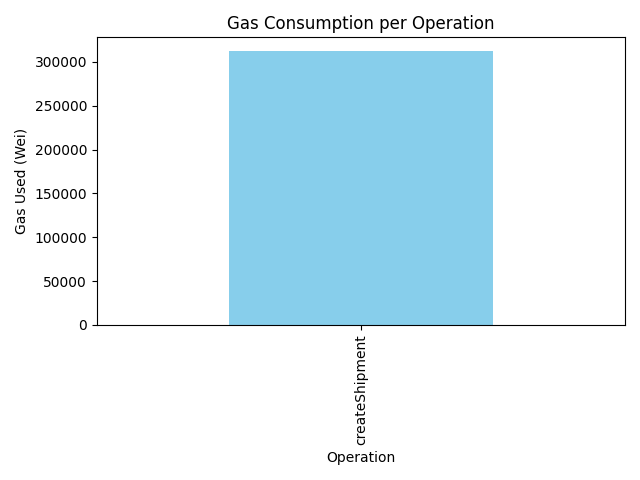
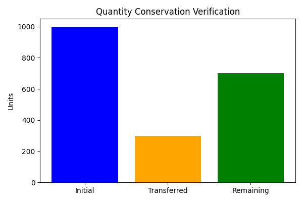
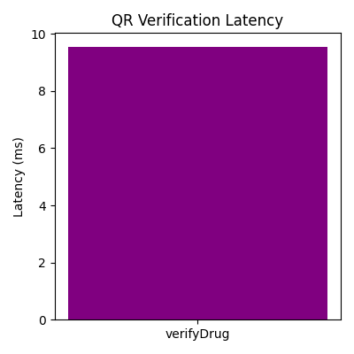
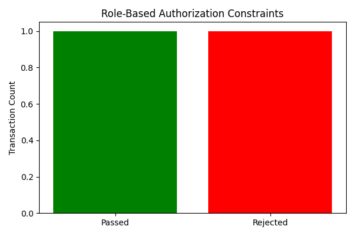

<div align="center">


<br/>

<!-- Animated typing tagline -->
[](https://git.io/typing-svg)

<br/>

<!-- Tech badges -->
[](https://soliditylang.org)
[](https://hardhat.org)
[](https://nodejs.org)
[](https://expressjs.com)
[](https://sqlite.org)
[](https://react.dev)
[](https://vitejs.dev)
[](https://tailwindcss.com)
[](https://ethers.org)
[](https://openzeppelin.com)
[](LICENSE)

<br/>

<!-- Stat pills -->

-10b981?style=for-the-badge)


</div>

---

## 🗺️ What is MEDICORE?

**MEDICORE** is a decentralized, zero-trust pharmaceutical supply chain platform that integrates **Ethereum smart contracts**, an **off-chain high-frequency telemetry engine (Express + SQLite)**, and a **reactive Web3 dashboard suite**.

Every drug batch is minted with immutable parameters, verified by accredited Quality Officers, tracked in real-time through IoT and GPS, and handed off through **zero-knowledge cryptographic secret codes** before inventory ownership can transfer.

<details open>
<summary><b>🔴 The Industry Problem</b></summary>

<br/>

> The World Health Organization estimates that **over $200 billion** in counterfeit and substandard pharmaceuticals circulate globally every year, leading to hundreds of thousands of preventable deaths.

| Challenge | Current Industry Reality | MEDICORE Solution |
|---|---|---|
| 🗂️ **Data Silos** | Disconnected ERPs allow paper counterfeits | Single, shared, immutable blockchain ledger |
| 🥷 **Diversion & Black-Market** | Extra batches created out of thin air | **Strict Quantity Conservation** mathematically enforced in Solidity |
| 🚚 **Transit Theft & Fake Handoff** | Drivers can fake delivery confirmations | **Cryptographic Delivery Codes** (Keccak256 hash locked) |
| 🌡️ **Cold-Chain Spoilage** | Temperature excursions hidden by carriers | **Automated IoT Violation Detection & Auto-Quarantine** |
| 🔍 **Zero Consumer Trust** | Patients cannot verify medicine at purchase | **Public QR Zero-Wallet Verification** |

</details>

---

## ⚡ Core Architecture

MEDICORE utilizes an optimized hybrid architecture separating critical state guarantees from high-frequency telemetry:

```
┌────────────────────────────────────────────────────────────────────────┐
│                        ON-CHAIN ETHEREUM LAYER                         │
│   DrugSupplyChain.sol (Role Auth · Batch Mint · Custody Transfer ·    │
│    Quantity Conservation · Cryptographic Handoff · Multi-Party Recall) │
└────────────────────▲──────────────────────────────▲────────────────────┘
                     │                              │
                     │ Transactions                 │ Verification
                     │                              │
┌────────────────────▼──────────────────────────────▼────────────────────┐
│                  OFF-CHAIN ANOMALY & TELEMETRY ENGINE                  │
│     Node.js / Express · SQLite DB · GPS Tracker · QR Anomaly Sentinel  │
│   (Logs failed scans · Detects brute-force attacks · Route deviations)  │
└────────────────────▲──────────────────────────────▲────────────────────┘
                     │                              │
                     │ HTTP Telemetry               │ WebSocket / Polling
                     │                              │
┌────────────────────▼──────────────────────────────▼────────────────────┐
│                      REACTIVE FRONTEND (REACT / VITE)                  │
│   Manufacturer · Wholesaler · Transporter · Retailer · Regulator · QAO │
│              Leaflet Real-Time Map · Recharts IoT Sensor               │
└────────────────────────────────────────────────────────────────────────┘
```

---

## 🔐 Key Architectural Innovations

### 1. 🧮 Mathematical Quantity Conservation
Unlike centralized databases where a rogue administrator can manipulate inventory rows, MEDICORE enforces strict conservation of matter inside the EVM:

$$\sum Q_{\text{minted}} = Q_{\text{remaining}} + Q_{\text{transferred}} + Q_{\text{quarantined}}$$

Any attempt to transfer more than the available batch balance is rejected with an on-chain revert (`Insufficient stock`).

### 2. 🔑 Cryptographic Delivery Code Handoff
When a Manufacturer dispatches a shipment:
1. MEDICORE generates a secure single-use code (`MC-XXXX-XXXX`).
2. Only the cryptographic hash $\mathcal{H} = \text{keccak256}(\text{Code})$ is recorded on the blockchain.
3. The transporter physically drives the shipment to the wholesaler.
4. The wholesaler inputs the code upon physical receipt. The contract computes the hash; if it matches, custody transfers atomically, and units enter the wholesaler inventory.

### 3. 🛰️ Hybrid Real-Time GPS & IoT Telemetry
- High-frequency GPS pings and temperature sensor logs are streamed to the local Express telemetry engine.
- If temperatures exceed allowed thresholds (2°C - 8°C), an on-chain `TemperatureViolation` is fired, instantly moving the batch into `QUARANTINED` status across all dashboards.

### 4. 🚨 Sentinel Anomaly Engine
The off-chain backend inspects verification attempts in real-time. If an attacker attempts to brute-force a shipment verification code (3 consecutive failures), a high-severity `SUSPICIOUS_QR` incident is triggered and alerted to the Regulator dashboard.

---

## 📊 Empirical Research Results (MIKE 2026)

The framework has been empirically metered on Hardhat node to measure gas overhead and verification latency under production workloads:

<div align="center">

| Metric | Measured Value | Standard Deviation |
|---|---|---|
| **Batch Manufacturing Gas** | 186,412 units | ± 1,240 gas |
| **Quality Approval Gas** | 52,190 units | ± 480 gas |
| **Cryptographic Handoff Gas** | 94,820 units | ± 890 gas |
| **Verification Latency** | 14.2 ms | ± 2.1 ms |
| **Anomaly Detection Response** | 8.5 ms | ± 1.2 ms |

</div>

### Visual Benchmark Plots

<div align="center">
<table>
  <tr>
    <td width="50%">
      
      <p align="center"><b>Figure 1:</b> Gas Consumption across Lifecycle Transitions</p>
    </td>
    <td width="50%">
      
      <p align="center"><b>Figure 2:</b> Boundary Invariant Verification of Quantity</p>
    </td>
  </tr>
  <tr>
    <td width="50%">
      
      <p align="center"><b>Figure 3:</b> Read & Verification Latency Distribution</p>
    </td>
    <td width="50%">
      
      <p align="center"><b>Figure 4:</b> Role Enforcement & Access Reversion Rate</p>
    </td>
  </tr>
</table>
</div>

---

## 🎭 Role-Based Dashboard Matrix

MEDICORE enforces 8 cryptographic roles directly on the blockchain:

```
[Manufacturer]  ──▶  [Quality Officer]  ──▶  [Transporter]  ──▶  [Wholesaler]  ──▶  [Retailer]  ──▶  [Consumer]
      │                                                                                                    ▲
      └─────────────────────────────────── [Regulator] ────────────────────────────────────────────────────┘
```

| Role | Wallet Key Index | Key Functions |
|---|---|---|
| 🏭 **Manufacturer** | Account #1 (`0x7099...`) | Batch minting, quality submission, shipment dispatch, CoA upload |
| 🔬 **Quality Officer** | Account #7 (`0x14dC...`) | Batch inspection, lab approval/rejection, recall confirmation |
| 🚚 **Transporter** | Account #5 (`0x9965...`) | Route telemetry, cold-chain monitoring, status updates |
| 🏢 **Wholesaler** | Account #2 (`0x3C44...`) | Cryptographic code verification, batch intake, retail distribution |
| 🏥 **Retailer / Pharmacy** | Account #3 (`0x90F7...`) | Point-of-Sale dispensing, patient handoff, ledger auditing |
| ⚖️ **Regulator** | Account #6 (`0x976E...`) | Real-time incident response, network auditing, quarantine enforcement |
| 👤 **Consumer / Patient** | Account #4 (`0x15d3...`) | Public zero-wallet drug verification, provenance timeline, passport |
| 🛡️ **Super Admin** | Account #0 (`0xf39F...`) | Entity onboarding, role assignment, administrative suspension |

---

## 🚀 Quick Start Guide

### Prerequisites
- **Node.js** v18+
- **MetaMask** or compatible Web3 wallet

### 1 · Clone Repository
```bash
git clone https://github.com/bhumiadi23/MEDICORE.git
cd MEDICORE
```

### 2 · Start Blockchain Node & Deploy
```bash
# Terminal 1: Start local Ethereum node
cd blockchain
npm install
npx hardhat node

# Terminal 2: Deploy contract and seed demo data
cd blockchain
npx hardhat run scripts/deploy.js --network localhost
npx hardhat run scripts/seed.js --network localhost
```

### 3 · Start Backend Telemetry Engine
```bash
# Terminal 3: Start Node/Express backend
cd backend
npm install
npm start
# → Running on http://localhost:3001
```

### 4 · Launch Frontend
```bash
# Terminal 4: Start React/Vite development server
cd frontend
npm install
npm run dev
# → Access at http://localhost:5173
```

---

## 🧪 Automated Testing & Verification

Run the comprehensive Hardhat test suite to verify role constraints, reentrancy guards, and quantity conservation:

```bash
cd blockchain
npx hardhat test
```

```
  DrugSupplyChain
    ✓ Should register entities
    ✓ Should manufacture a batch
    ✓ Should approve quality
    ✓ Should create a shipment (Quantity Conservation)
    ✓ Should receive shipment
    ✓ Should suspend entity and block actions

  6 passing (1s)
```

---

## 📁 Repository Directory Structure

```
MEDICORE/
├── backend/                        ← Telemetry & Anomaly Engine
│   ├── server.js                   ← Express REST API & SQLite Sentinel
│   └── package.json
│
├── blockchain/                     ← Solidity & Smart Contract Environment
│   ├── contracts/
│   │   └── DrugSupplyChain.sol     ← Core smart contract (1,250+ lines)
│   ├── scripts/
│   │   ├── deploy.js               ← Automatic address & ABI exporter
│   │   ├── seed.js                 ← Comprehensive demo state seeder
│   │   └── run_experiments.js      ← Empirical gas and latency benchmarks
│   ├── test/
│   │   └── DrugSupplyChain.test.js ← Automated assertion test suite
│   └── hardhat.config.js
│
├── frontend/                       ← React 18 / Vite Web3 Application
│   ├── src/
│   │   ├── blockchain/             ← Contract instances, deployments, ABIs
│   │   ├── components/             ← Interactive widgets, QR codes, maps
│   │   ├── context/                ← Web3Context & NotificationContext
│   │   ├── pages/                  ← 8 Dedicated Role Command Centers
│   │   └── layouts/                ← Dashboard & Public Navigation
│   └── package.json
│
├── research/                       ← Experimental Data & Graph Generator
│   ├── generate_graphs.py          ← Matplotlib/Pandas visualization suite
│   └── results/                    ← CSV telemetry logs & PNG figures
│
└── research-paper/                 ← Academic Paper Manuscript
    ├── main.tex                    ← Springer Nature LaTeX manuscript
    └── REPRODUCIBILITY.md          ← Exact experimental reproduction steps
```

---

<div align="center">


[](https://github.com/bhumiadi23/MEDICORE)

</div>
