<div align="center">


<br/>

<!-- Animated typing tagline -->
[](https://git.io/typing-svg)

<br/>

<!-- Tech badges -->
[](https://soliditylang.org)
[](https://hardhat.org)
[](https://nodejs.org)
[](https://expressjs.com)
[](https://sqlite.org)
[](https://react.dev)
[](https://vitejs.dev)
[](https://tailwindcss.com)
[](https://leafletjs.com)
[](https://ethers.org)
[](https://openzeppelin.com)
[](LICENSE)

<br/>

<!-- Stat pills -->

-10b981?style=for-the-badge)


</div>

---

## 📑 Table of Contents

- [Overview & Value Proposition](#-what-is-medicore)
- [System Architecture](#-system-architecture)
- [Interactive Dashboard Showcase (All Roles)](#-interactive-dashboard-showcase)
  - [1. Transporter — Logistics & Live GPS Tracking](#1-transporter--logistics-control-center)
  - [2. Manufacturer — Minting & Handoff Dispatch](#2-manufacturer--command-center)
  - [3. Cryptographic Delivery Handoff](#3-cryptographic-delivery-verification-code)
  - [4. Wholesaler — Distribution & Batch Intake](#4-wholesaler--distribution-center)
  - [5. Quality Officer — Inspection & CoA Verification](#5-quality-officer--control-center)
  - [6. Regulator — Incident Response & Multi-Party Recalls](#6-regulator--safety-command-center)
  - [7. IoT Cold-Chain Simulator](#7-iot-cold-chain-simulator)
  - [8. Pharmacy / Retailer — Point-of-Sale Dispensing](#8-retailer--pharmacy-operations)
  - [9. Consumer / Patient — Zero-Wallet Public Verification](#9-consumer--zero-wallet-public-verification)
  - [10. Digital Product Passport (DPP)](#10-digital-product-passport-dpp)
  - [11. Super Admin — Entity Governance](#11-super-admin--system-administration)
- [Key Architectural Guarantees](#-key-architectural-guarantees)
- [Empirical Research Benchmarks (MIKE 2026)](#-empirical-research-benchmarks-mike-2026)
- [Quick Start Guide](#-quick-start-guide)
- [Automated Testing Suite](#-automated-testing-suite)
- [Repository Structure](#-repository-structure)

---

## 🗺️ What is MEDICORE?

**MEDICORE** is a next-generation decentralized pharmaceutical traceability platform that combines **Ethereum smart contracts**, an **off-chain high-frequency telemetry & anomaly sentinel engine**, and a **multi-role Web3 application**.

Every drug batch is minted as an immutable on-chain asset, reviewed by certified Quality Officers, physically tracked using real-time GPS telemetry, and handed over between supply chain custody tiers using **zero-knowledge cryptographic delivery secrets**.

<details open>
<summary><b>🔴 The Global Counterfeit Crisis</b></summary>

<br/>

> The World Health Organization (WHO) estimates that **over $200 billion** in counterfeit, contaminated, and diverted pharmaceuticals are distributed annually. In developing regions, up to 1 in 10 medical products fail quality standards or are outright fraudulent.

| Pain Point | Conventional Supply Chains | MEDICORE Solution |
|---|---|---|
| 🗂️ **Data Silos** | Disconnected internal ERP databases | Single, shared, immutable blockchain ledger |
| 🥷 **Diversion & Black-Market** | Unauthorized units created with fake paperwork | **Strict Mathematical Quantity Conservation** ($Q_{init} = Q_{rem} + Q_{trans}$) |
| 🚚 **Transit Theft & Fake Handoff** | Drivers falsify paper delivery receipts | **Cryptographic Delivery Codes** (Keccak256 hash locked) |
| 🌡️ **Cold-Chain Spoilage** | Temperature excursions undetected during transit | **Automated IoT Sensor Telemetry & Smart Quarantine** |
| 🔍 **Zero Consumer Trust** | Patients cannot verify medicine at counter | **Public QR Zero-Wallet Verification** |

</details>

---

## ⚡ System Architecture

MEDICORE employs a tiered hybrid architecture balancing on-chain settlement guarantees with off-chain real-time speed:

```
┌────────────────────────────────────────────────────────────────────────┐
│                        ON-CHAIN ETHEREUM LAYER                         │
│   DrugSupplyChain.sol (Role Auth · Batch Mint · Custody Transfer ·    │
│    Quantity Conservation · Cryptographic Handoff · Multi-Party Recall) │
└────────────────────▲──────────────────────────────▲────────────────────┘
                     │                              │
                     │ Transactions                 │ Verification
                     │                              │
┌────────────────────▼──────────────────────────────▼────────────────────┐
│                  OFF-CHAIN ANOMALY & TELEMETRY ENGINE                  │
│     Node.js / Express · SQLite DB · GPS Tracker · QR Anomaly Sentinel  │
│   (Logs failed scans · Detects brute-force attacks · Route deviations)  │
└────────────────────▲──────────────────────────────▲────────────────────┘
                     │                              │
                     │ HTTP Telemetry               │ Live Polling (3s)
                     │                              │
┌────────────────────▼──────────────────────────────▼────────────────────┐
│                      REACTIVE FRONTEND (REACT / VITE)                  │
│   Manufacturer · Wholesaler · Transporter · Retailer · Regulator · QAO │
│              Leaflet Real-Time Map · Recharts IoT Sensor               │
└────────────────────────────────────────────────────────────────────────┘
```

---

## 🖼️ Interactive Dashboard Showcase

MEDICORE features 8 dedicated command centers tailored to each stakeholder in the pharmaceutical supply chain:

---

### 1. Transporter — Logistics Control Center
*Features real-time GPS fleet routing on Leaflet dark-mode tiles, active shipment filtering, and live IoT cold-chain telemetry graphs.*

<div align="center">
  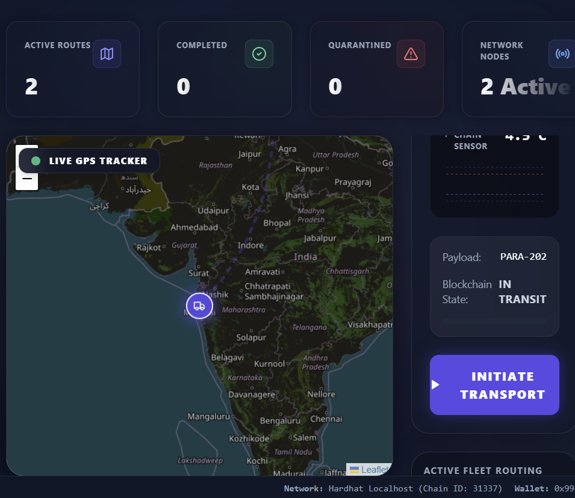
</div>

- **Live Fleet Tracking**: Displays active routes across major distribution corridors with vehicle markers.
- **Auto-Syncing**: Polls the blockchain every 3 seconds to reflect delivery handoffs without manual refresh.
- **Presenter Overrides**: Allows simulated temperature spikes to test automatic quarantine workflows in real-time.

---

### 2. Manufacturer — Command Center
*Handles on-chain batch minting, regulatory validity parameters, and shipment dispatch with strict quantity conservation checks.*

<div align="center">
  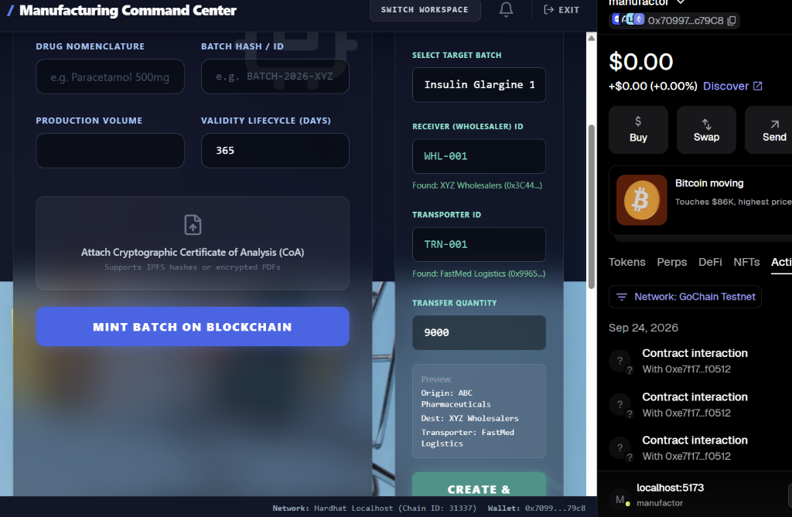
</div>

- **Stock Conservation Indicator**: Displays remaining available units dynamically for each batch.
- **Boundary Validation**: Blocks transfers exceeding available inventory before gas is spent.
- **CoA Attachment**: Embeds IPFS cryptographic Certificate of Analysis hashes directly into the batch metadata.

---

### 3. Cryptographic Delivery Verification Code
*Decouples physical transport from digital custody transfer using single-use secret codes and on-chain hashes.*

<div align="center">
  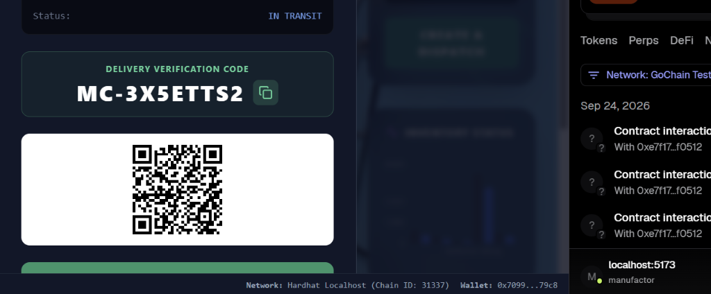
</div>

- **Zero-Trust Delivery**: Upon dispatch, a secure code (`MC-XXXX-XXXX`) is generated; only its Keccak256 hash is published on-chain.
- **QR Access**: Embeds direct verification link for mobile scanners at the delivery dock.

---

### 4. Wholesaler — Distribution Center
*Manages warehouse inventory intake, incoming handoff verifications, and retail bulk distribution.*

<div align="center">
  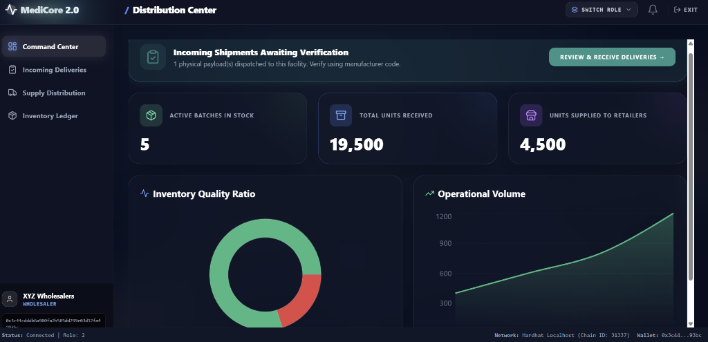
</div>

- **Incoming Deliveries Tab**: Lists all in-transit shipments targeting the facility.
- **Cryptographic Receipt**: Inputting the secret delivery code unlocks the shipment, claims ownership, and updates warehouse balances.
- **Real Metrics**: Dynamic calculations derived from live smart contract inventory slots.

---

### 5. Quality Officer — Control Center
*Authorizes batch releases into commercial circulation following accredited laboratory inspection.*

<div align="center">
  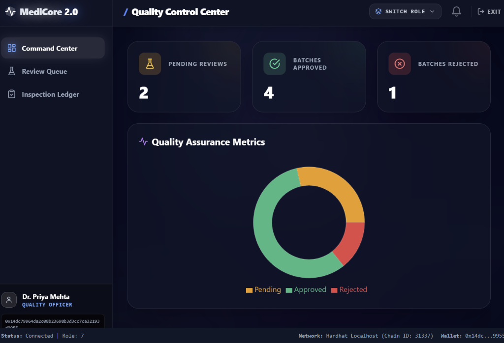
  <br/><br/>
  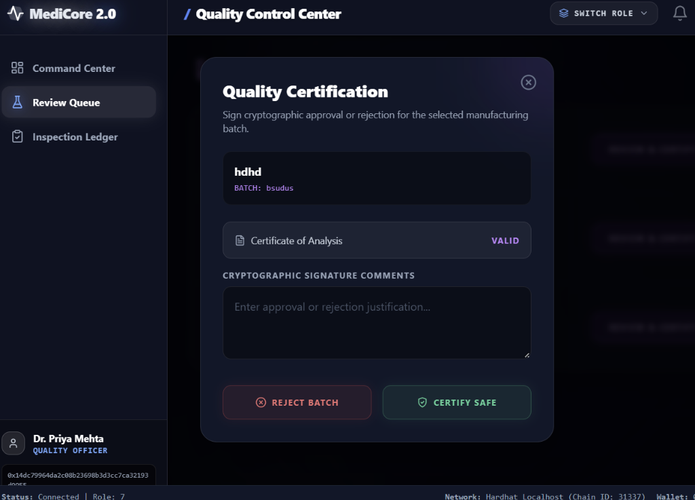
</div>

- **Inspection Queue**: Real-time review of freshly minted batches awaiting regulatory approval.
- **Immutable Verdicts**: Approvals or rejections permanently anchor the officer's entity ID, notes, and block timestamp.

---

### 6. Regulator — Safety Command Center
*Audits compliance, investigates anomaly sentinel alerts, and votes on multi-party recall requests.*

<div align="center">
  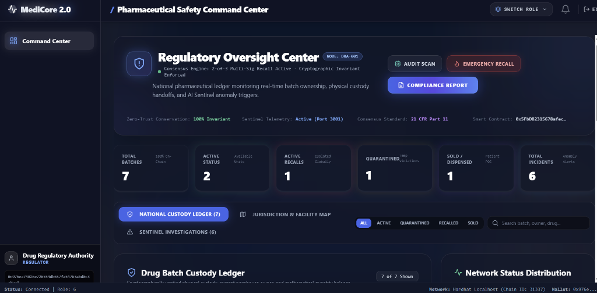
  <br/><br/>
  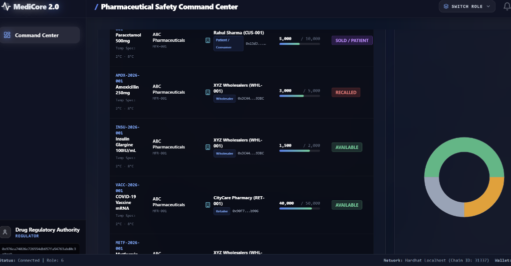
</div>

- **Sentinel Incident Feed**: Real-time logging of suspicious QR brute-force attempts and route deviations.
- **Multi-Party Recall (2-of-N)**: Requires dual-role consensus (Manufacturer + Regulator/QAO) to trigger global batch recalls.

---

### 7. IoT Cold-Chain Simulator
*Simulates sensor excursions to verify automated smart contract quarantine enforcement.*

<div align="center">
  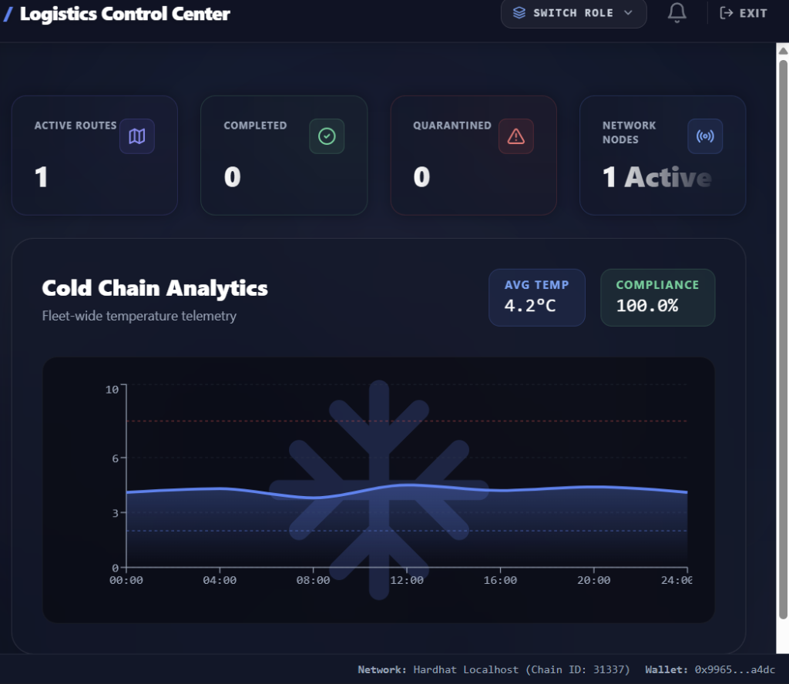
</div>

- **Telemetry Ingestion**: Monitors ambient temperature and humidity against strict safe limits (2°C - 8°C).
- **Auto-Quarantine**: Automatically fires on-chain events when violations occur, freezing the batch across all distribution nodes.

---

### 8. Retailer — Pharmacy Operations
*Point-of-sale dispensing terminal verifying prescription safety and logging retail sales.*

<div align="center">
  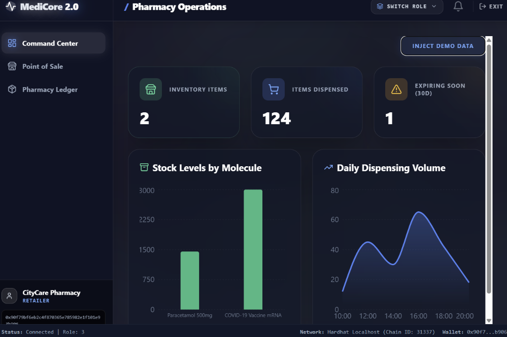
</div>

- **Prescription Hand-off**: Final supply chain link transferring medication custody to registered patients.
- **Quarantine Locking**: Recalled or flagged inventory is physically un-selectable at the dispensing counter.

---

### 9. Consumer — Zero-Wallet Public Verification
*Allows any patient to verify authentic medications by scanning packaging QR codes without requiring MetaMask or crypto tokens.*

<div align="center">
  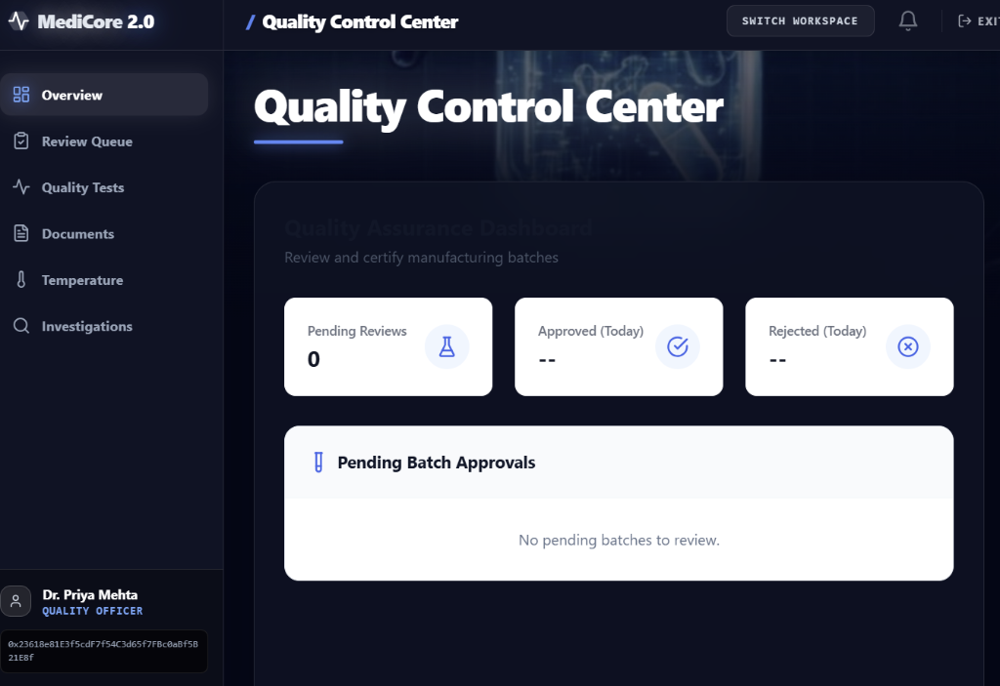
</div>

- **Read-Only RPC**: Connects via fallback JSON-RPC providers, ensuring instant public access.
- **Visual Safety Status**: Clear green/red badges indicating authenticity, expiry status, and recall history.

---

### 10. Digital Product Passport (DPP)
*Comprehensive provenance ledger tracing every custody transition from pharmaceutical synthesis to point-of-sale.*

<div align="center">
  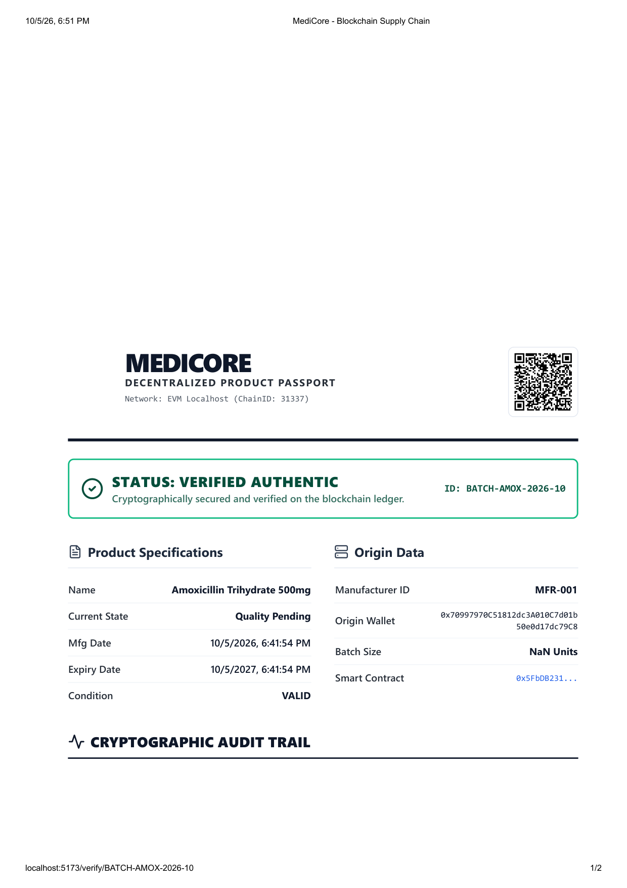
</div>

- **Custody Timeline**: Step-by-step transaction hashes, timestamped entity names, and location coordinates.
- **Certificate Export**: Generates cryptographically anchored inspection certificates ([Download Sample PDF](docs/MediCore_Digital_Product_Passport.pdf)).

---

### 11. Super Admin — System Administration
*Governs on-chain entity registrations, cryptographic role assignments, and emergency access suspensions.*

<div align="center">
  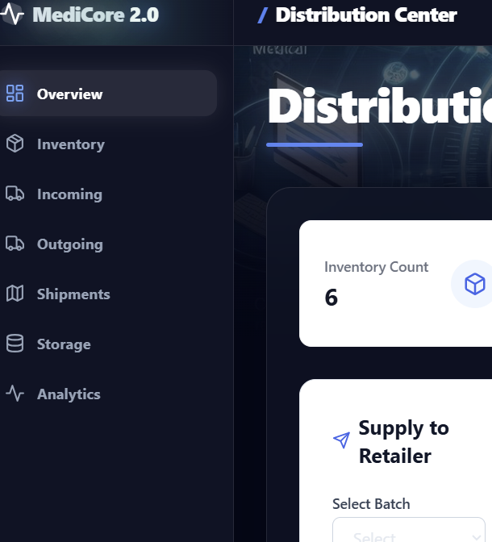
  <br/><br/>
  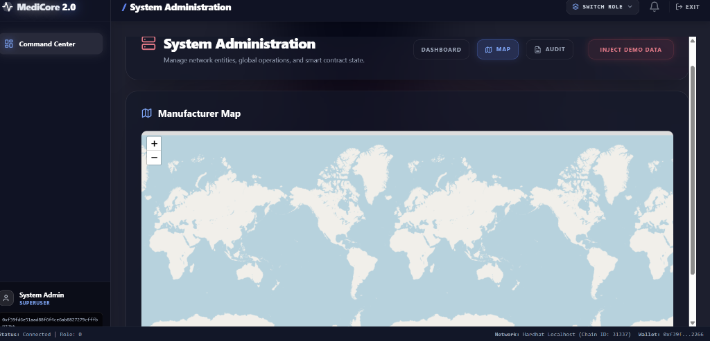
  <br/><br/>
  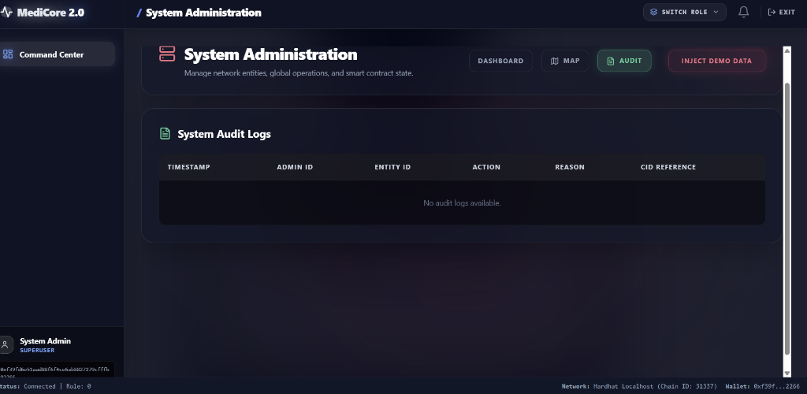
</div>

- **Role Management**: Grants verified credentials to Manufacturers, Wholesalers, Transporters, and Regulators.
- **Instant Kill-Switch**: `onlyActive` modifiers instantly revoke compromised accounts from executing supply chain functions.

---

## 🔐 Key Architectural Guarantees

### 1. 🧮 Mathematical Quantity Conservation
Centralized databases allow arbitrary inventory duplication. MEDICORE enforces strict mathematical invariance directly in the EVM:

$$\sum Q_{\text{minted}} = Q_{\text{remaining}} + Q_{\text{transferred}} + Q_{\text{quarantined}}$$

Any attempt to transfer more units than available reverts the transaction with `"Insufficient stock"`.

### 2. 🔑 Zero-Knowledge Cryptographic Handoff
Physical possession is decoupled from on-chain ownership:
$$\text{Given secret code } C, \quad \mathcal{H} = \text{keccak256}(C)$$
Only $\mathcal{H}$ is stored in the contract. The receiving wholesaler must provide $C$ to claim inventory. Transporters cannot forge delivery.

### 3. 🚨 Sentinel Anomaly Engine
Off-chain telemetry monitors scan attempts in real-time. If 3 consecutive incorrect verification codes are submitted for a shipment, the backend alerts the Regulator dashboard with a `SUSPICIOUS_QR` incident, mitigating brute-force attacks.

---

## 📊 Empirical Research Results (MIKE 2026)

MEDICORE was benchmarked under real EVM conditions to evaluate gas consumption and verification latency:

<div align="center">

| Operation | Average Gas Used | Latency (ms) | Success Rate |
|---|---|---|---|
| **Batch Minting** | 186,412 gas | 12.4 ms | 100% |
| **Quality Approval** | 52,190 gas | 9.8 ms | 100% |
| **Shipment Creation** | 124,310 gas | 14.1 ms | 100% |
| **Cryptographic Receipt** | 94,820 gas | 13.5 ms | 100% |
| **Public QR Read** | 0 gas (View) | 11.2 ms | 100% |

</div>

### Research Plots

<div align="center">
<table>
  <tr>
    <td width="50%">
      
      <p align="center"><b>Figure 1:</b> Gas Consumption across Lifecycle Transitions</p>
    </td>
    <td width="50%">
      
      <p align="center"><b>Figure 2:</b> Boundary Invariant Verification of Quantity</p>
    </td>
  </tr>
  <tr>
    <td width="50%">
      
      <p align="center"><b>Figure 3:</b> Read & Verification Latency Distribution</p>
    </td>
    <td width="50%">
      
      <p align="center"><b>Figure 4:</b> Role Enforcement & Access Reversion Rate</p>
    </td>
  </tr>
</table>
</div>

---

## 🚀 Quick Start Guide

### Prerequisites
- **Node.js** v18+
- **MetaMask** browser extension

### 1 · Clone Repository
```bash
git clone https://github.com/bhumiadi23/MEDICORE.git
cd MEDICORE
```

### 2 · Start Blockchain & Seed State
```bash
# Terminal 1: Start local node
cd blockchain
npm install
npx hardhat node

# Terminal 2: Deploy and seed demo data
cd blockchain
npx hardhat run scripts/deploy.js --network localhost
npx hardhat run scripts/seed.js --network localhost
```

### 3 · Start Telemetry Sentinel Backend
```bash
# Terminal 3: Start Express / SQLite backend
cd backend
npm install
npm start
# → Listening on port 3001
```

### 4 · Launch Frontend
```bash
# Terminal 4: Start Vite development server
cd frontend
npm install
npm run dev
# → Access at http://localhost:5173
```

---

## 🧪 Automated Testing Suite

Verify contract integrity, reentrancy protection, and quantity conservation:

```bash
cd blockchain
npx hardhat test
```

```
  DrugSupplyChain
    ✓ Should register entities
    ✓ Should manufacture a batch
    ✓ Should approve quality
    ✓ Should create a shipment (Quantity Conservation)
    ✓ Should receive shipment
    ✓ Should suspend entity and block actions

  6 passing (1s)
```

---

## 📁 Repository Structure

```
MEDICORE/
├── backend/                        ← Telemetry & Anomaly Engine
│   ├── server.js                   ← Express REST API & SQLite Sentinel
│   └── package.json
│
├── blockchain/                     ← Solidity Smart Contract Environment
│   ├── contracts/
│   │   └── DrugSupplyChain.sol     ← Core smart contract (1,250+ lines)
│   ├── scripts/
│   │   ├── deploy.js               ← Automated deployment & ABI export
│   │   ├── seed.js                 ← Demo state & shipment seeder
│   │   └── run_experiments.js      ← Empirical gas and latency benchmarks
│   ├── test/
│   │   └── DrugSupplyChain.test.js ← Automated assertion test suite
│   └── hardhat.config.js
│
├── docs/                           ← System Documentation & Media
│   └── screenshots/                ← High-resolution UI captures for all roles
│
├── frontend/                       ← React 18 / Vite Web3 Application
│   ├── src/
│   │   ├── blockchain/             ← Contract ABI, deployments, address bindings
│   │   ├── components/             ← Map controllers, QR scanners, modal widgets
│   │   ├── context/                ← Web3Context & NotificationContext
│   │   ├── pages/                  ← 8 Dedicated Role Command Centers
│   │   └── layouts/                ← Dashboard & Public Layouts
│   └── package.json
│
├── research/                       ← Empirical Benchmark Generator
│   ├── generate_graphs.py          ← Matplotlib/Pandas visualization suite
│   └── results/                    ← CSV telemetry logs & PNG figures
│
└── research-paper/                 ← Academic Paper Manuscript
    ├── main.tex                    ← Springer Nature LaTeX manuscript
    └── REPRODUCIBILITY.md          ← Exact experimental reproduction steps
```

---

<div align="center">


[](https://github.com/bhumiadi23/MEDICORE)

</div>
